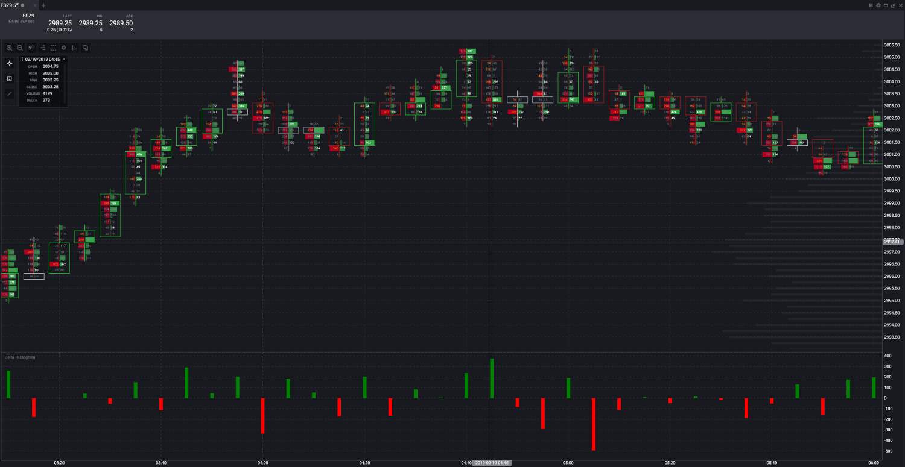

# tradovate-custom-indicators
Tradovate  offers a robust custom indicator solution that allows users to create/add indicators using JavaScript coding language.  In addition, Tradovate offers a complete open-source library to all Tradovate indicators with the ability to save and modify any current indicators, create your own from scratch, or upload an indicator in JavaScript. [More](https://tradovate.zendesk.com/hc/en-us/articles/115011665727-How-do-I-use-custom-indicators-in-Tradovate-)

## Delta Histogram
Tradovate has nice feature to view footprint chart(bid-ask volume), but currently lag features like bar delta and few more things. So I have created delta histogram indicator community can use this for now until we get that feature in chart itself. [More](https://tradovate.zendesk.com/hc/en-us/community/posts/360000855987-Order-Flow-2-0?page=1)

##### How to install
Indicator -> Explore Community Indicator

After successfully installation the indicator is located at under Volume-based --> Delta Histogram
 
##### Example

## MA Histogram
Moving average histogram indicator will plot histogram and changes color when they cross each other, base upon your strategies if correct parameter were set, this can tell you when trend is changing.  

##### How to install
Indicator -> Explore Community Indicator

After successfully installation the indicator is located at under Moving Averages --> MA Histogram
 
##### Example

