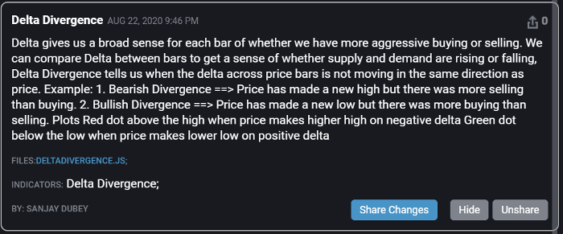

# tradovate-custom-indicators
Tradovate  offers a robust custom indicator solution that allows users to create/add indicators using JavaScript coding language.  In addition, Tradovate offers a complete open-source library to all Tradovate indicators with the ability to save and modify any current indicators, create your own from scratch, or upload an indicator in JavaScript. [More](https://tradovate.zendesk.com/hc/en-us/articles/115011665727-How-do-I-use-custom-indicators-in-Tradovate-)

## Delta Histogram
Tradovate has nice feature to view footprint chart(bid-ask volume), but currently lag features like bar delta and few more things. So I have created delta histogram indicator community can use this for now until we get that feature in chart itself. [More](https://tradovate.zendesk.com/hc/en-us/community/posts/360000855987-Order-Flow-2-0?page=1)

##### How to install
Indicator -> Explore Community Indicator  

After successfully installation the indicator is located at under Volume-based --> Delta Histogram
 
##### Example

## Delta Candle
Delta is a key concept to understand when making trading decisions based upon traded volume.
It’s the difference between the volume of market orders buying by lifting the offer price and the volume of market orders selling by hitting the bid price. 
In other words, if Delta is greater than zero, we had more buying than selling and if Delta is less than zero, we had more selling than buying.

#####Plots
Delta candlestick on the chart & OHLC of delta on data box

Historical data doesn't contains sequence of the volumes, so you won't see high and low of delta for historical data.
**It's going to show candlestick delta chart only if you have it open.**

##### How to install
Indicator -> Explore Community Indicator  

After successfully installation the indicator is located at under Volume-based --> Delta Candle
 
##### Example

## Delta Divergence
#####Description
Delta gives us a broad sense for each bar of whether we have more aggressive buying or selling. 
We can compare Delta between bars to get a sense of whether supply and demand are rising or falling,
Delta Divergence tells us when the delta across price bars is not moving in the same direction as price.

Example:
1. Bearish Divergence ==> Price has made a new high but there was more selling than buying.
2. Bullish Divergence ==> Price has made a new low but there was more buying than selling. 

#####Plots
Red dot above the high when price makes higher high on negative delta  
Green dot below the low when price makes lower low on positive delta

##### How to install
Indicator -> Explore Community Indicator  

After successfully installation the indicator is located at under Volume-based --> Delta Divergence
 
##### Example

## The VPOC of each bar (the price with the highest volume)
#####Description
Volume point of control(VPOC), refers to the price at which the highest volume of trading occurred.
This indicator will calculate VPOC in real time for each bar

#####Parameter
boxColor: The color of the box around VPOC
boxWidth: Depends on your chart type, box width is adjustable for best view
lineOpacity: The transparency of lines
lineWidth: The thickness of lines

#####Plots
Rectangle box around VPOC for each bid/ask bar  
**You can adjust the box width depends on the future contract you trade.**

##### How to install
Indicator -> Explore Community Indicator  

After successfully installation the indicator is located at under Volume-based --> VPOC (BAR)
 
##### Example

## MA Histogram
Moving average histogram indicator will plot histogram and changes color when they cross each other, base upon your strategies if correct parameter were set, this can tell you when trend is changing.  

##### How to install
Indicator -> Explore Community Indicator  

After successfully installation the indicator is located at under Moving Averages --> MA Histogram
 
##### Example

## On Balance Volume & On Balance Volume Modified
##### [On Balance Volume](https://tlc.thinkorswim.com/center/reference/Tech-Indicators/studies-library/O-Q/OnBalanceVolume)
On Balance Volume keeps a running total of volume flowing into or out of a security. When the security closes higher than the previous close, all of the day's volume is considered up-volume. A close lower than the previous day's results in all of the day's volume considered down-volume. A rising OBV is defined as a sign of smart money flowing into a security. As the public then moves into the security, both the security and the OBV will surge ahead. If the price movement precedes the OBV movement, it is called a "non-confirmation." Non-confirmations tend to occur at bull market tops or at bear market bottoms.

When the security's price closes up, the day's OBV is created by adding the day's volume to the cumulative total. The day's volume is subtracted from the cumulative total when the price closes down.

##### [On Balance Volume Modified](https://tlc.thinkorswim.com/center/reference/Tech-Indicators/studies-library/O-Q/OnBalanceVolumeModified)
The OnBalanceVolumeModified (OBVM) study is a technical indicator introduced by Vitali Apirine. It is a variation of OnBalanceVolume (OBV). In the modified version, OBV is given a smoothing (by an exponential moving average, by default). In addition, a signal line is introduced. The signal line is a slower moving average of the smoothed-out OBV.  

When the main line of the OBVM is rising, the volume might be gaining positive pressure, which may further result in an increase of the price. Conversely, decreasing OBVM may signify decreasing volume pressure and a further price reduction. 

The main line can also be analyzed in terms of divergences from the main price plot. The signal line can be used to identify crossovers.

##### How to install
Indicator -> Explore Community Indicator  

After successfully installation the indicator is located at under Volume-based --> On Balance Volume/On Balance Volume Modified

##### Example
